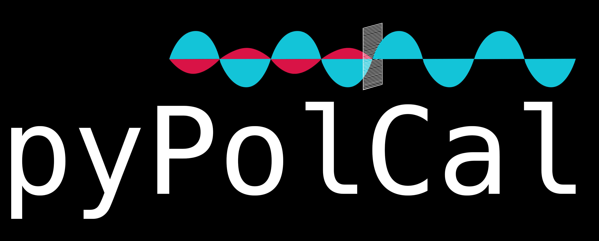

This Python library provides tools for fitting and visualizing Mueller matrix models for **SCExAO VAMPIRES** and the **SCExAO CHARIS spectropolarimetric mode**. In the future it will be updated for compatibility with other instruments.

You can fit either:
- A **physically motivated model** 
- A **direct fit** of retardances and diattenuations.

---

## Features
- Create Mueller matrix models with `pyMuellerMat` `physical_models` branch
- Fit using:
  - `emcee`
  - `scipy.optimize.minimize`
  - `scipy.optimize.least_squares`
- Calibration data handling via CSVs
- Save fitting results as `.txt` files
- Tutorial Jupyter notebooks for both VAMPIRES and CHARIS (see `VAMPIRES/` and `CHARIS/` folders)

---

## Requirements
- Python ≥ 3.11

---

## Installation
1. Create and activate a new virtual Python or Conda environment.

2. Clone the repository into your desired directory:
```bash
git clone https://github.com/UCSB-Exoplanet-Polarimetry-Lab/pyPolCal.git
cd pyPolCal
```
3. Install the package and its dependencies. Editable mode (`-e`) is recommended, as it allows you to modify the source code — this is often necessary for this package:
```bash
pip install -e .
```

---
